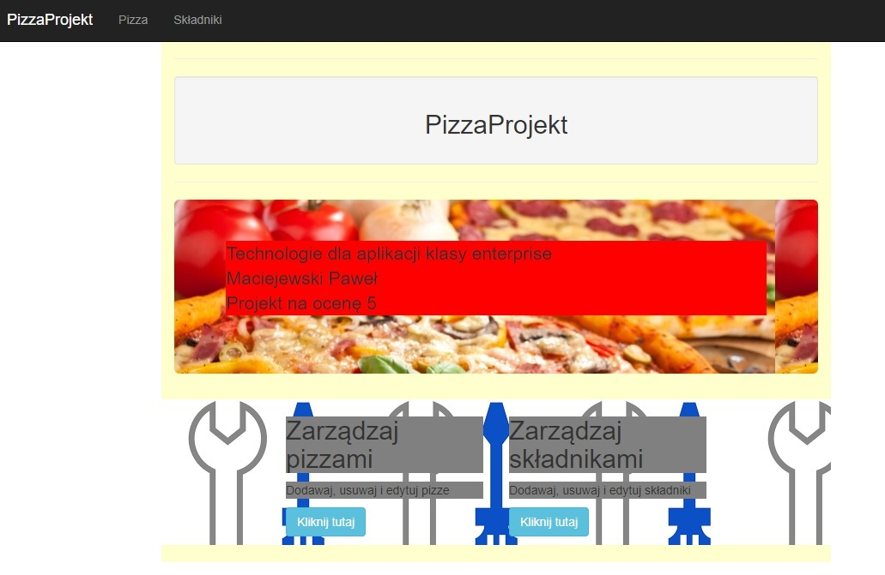
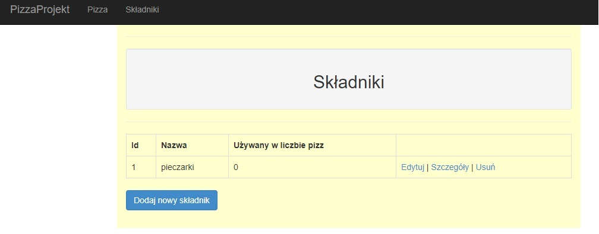
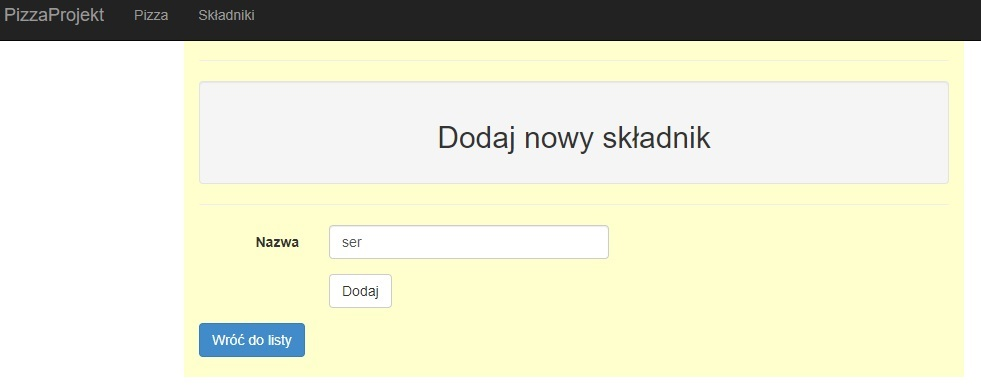
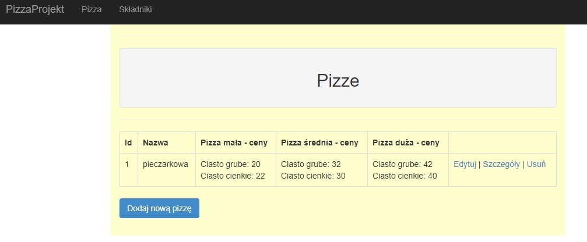
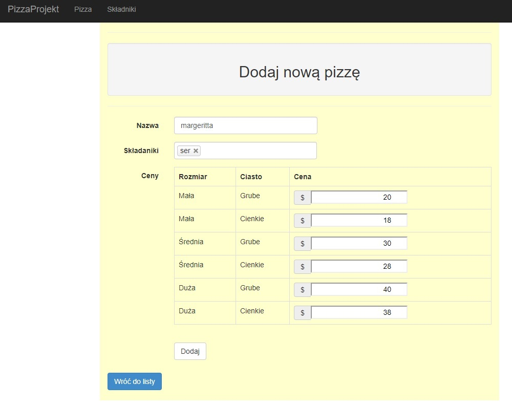

# PizzaProjekt

## ENG

Simple application created in .NET MVC technology and with SQL database for better grade at the university. I added it on GitHub only to make it easier for my younger colleagues to create their own application. Please don't expect any great apps here.

Assumption:
- displaying, adding, editing, deleting pizza ingredients,
- displaying, adding, editing, deleting a pizza consisting of defined ingredients and prices for various types of sizes.

## PL

Prosty projekt aplikacji w technologii .NET MVC i bazą danych SQL na dodatkową ocenę na uczelni. Dodałem go na GitHub jedynie w celu ułatwienia młodszym kolegom stworzenia własnej aplikacji. Proszę nie spodziewać się tutaj jakieś super aplikacji.

Założenie:
- wyświetlanie, dodawanie, edytowanie, usuwanie składników pizzy,
- wyświetlanie, dodawanie, edytowanie, usuwanie pizzy składającej się ze zdefiniowanych składników oraz ceny dla różnych rodzajów wielkości.

## Screenshots

### Home page

### Ingredients list

### Ingredients add

### Pizza list

### Pizza add
